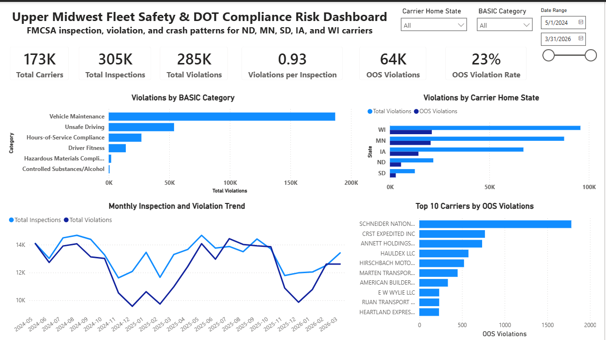
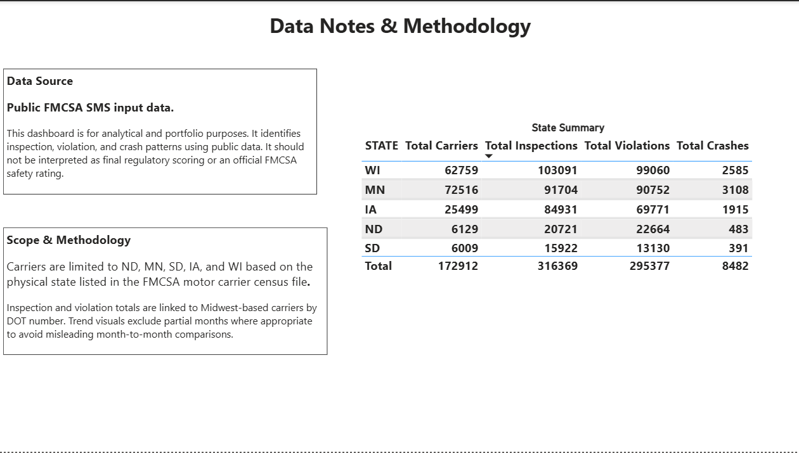
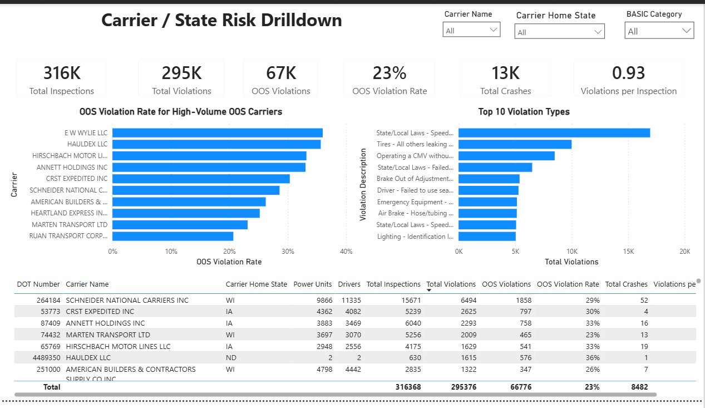

# Upper Midwest Fleet Safety & DOT Compliance Risk Dashboard

## Project Overview

This project analyzes public FMCSA Safety Measurement System (SMS) input data to identify inspection, violation, out-of-service, and crash patterns for motor carriers based in the Upper Midwest.

The dashboard focuses on carriers physically based in:

* North Dakota
* Minnesota
* South Dakota
* Iowa
* Wisconsin

The goal of this project is to create a practical safety and compliance dashboard that could support management review, carrier risk monitoring, and operational safety analysis.

## Business Questions Answered

This dashboard was built to answer practical safety and compliance questions, including:

- How large is the overall safety and compliance risk picture for Upper Midwest carriers?
- Which carrier home states have the highest inspection, violation, OOS, and crash volumes?
- Which FMCSA BASIC categories are driving the most violations?
- How do inspections and violations trend over time?
- Which carriers account for the highest number of OOS violations?
- Which high-volume OOS carriers have the highest OOS violation rates?
- What violation descriptions appear most often?
- Which carriers may need closer review based on inspections, violations, OOS activity, crashes, and violation rates?

## Dashboard Pages

### 1. Executive Safety Overview

The first page provides a high-level view of the overall safety and compliance picture.

Key visuals include:

* Total carriers
* Total inspections
* Total violations
* Out-of-service violations
* Out-of-service violation rate
* Violations per inspection
* Violations by BASIC category
* Violations by carrier home state
* Monthly inspection and violation trend
* Top 10 carriers by OOS violations

This page answers:

**How large is the risk picture, and where is it concentrated?**

### 2. Data Notes & Methodology

The second page documents the data source, dashboard scope, and methodology notes.

It includes:

* Data source explanation
* Scope and methodology notes
* State summary table

This page is included to make the dashboard more transparent and to explain how the analysis should be interpreted.

### 3. Carrier / State Risk Drilldown

The third page provides a more detailed carrier-level review.

Key visuals include:

* Carrier-level KPI cards
* Carrier name, carrier home state, and BASIC category slicers
* OOS violation rate for high-volume OOS carriers
* Top 10 violation types
* Carrier risk summary table

This page answers:

**Which carriers or states may need closer review?**

## Tools Used

* Power BI Desktop
* Power Query
* DAX
* Python / Jupyter Notebook for data cleaning
* Public FMCSA SMS input data

## Data Source

The project uses public FMCSA SMS input data, including carrier census, inspection, violation, and crash records.

This dashboard is for analytical and portfolio purposes. It should not be interpreted as final regulatory scoring or an official FMCSA safety rating.

## Data Preparation

The raw FMCSA files were cleaned and filtered to focus on carriers based in ND, MN, SD, IA, and WI.

Main preparation steps included:

* Filtering motor carrier census records to Upper Midwest carrier home states
* Linking inspections and violations to Midwest-based carriers by DOT number
* Creating cleaned fact and dimension tables
* Creating a date table for monthly trend analysis
* Removing partial months from trend visuals where appropriate
* Building DAX measures for inspections, violations, OOS violations, OOS rate, crashes, and violations per inspection

## Key Measures

The dashboard includes measures such as:

* Total Carriers
* Total Inspections
* Total Violations
* Total Crashes
* OOS Violations
* OOS Violation Rate
* Violations per Inspection
* Crashes per 1,000 Carriers

## Key Insights

Some of the main findings from the dashboard include:

* Vehicle Maintenance is the largest BASIC violation category.
* Wisconsin, Minnesota, and Iowa show the highest total violation volumes among the selected carrier home states.
* Inspections and violations generally move together over time.
* A small number of carriers account for a large number of OOS violations.
* Carrier-level analysis provides more useful context when reviewing both violation counts and OOS violation rates.

## Dashboard Screenshots

### Executive Safety Overview



### Data Notes & Methodology



### Carrier / State Risk Drilldown



## Repository Contents

```text

upper-midwest-fleet-safety-dashboard/
│
├── README.md
├── LICENSE
│
├── images/
│   ├── executive-overview.png
│   ├── data-notes-methodology.png
│   └── carrier-state-risk-drilldown.png
│
├── notebooks/
│   └── 01_fmcsa_data_cleaning.ipynb
│
└── data_dictionary/
    └── dashboard_field_notes.md
```

## Notes

Large raw FMCSA source files are not included in this repository due to file size. The dashboard was built using cleaned and filtered data derived from public FMCSA SMS input files.

The Power BI `.pbix` file is not included in this repository due to file size limits.

## Project Purpose

This project was built as a portfolio project to demonstrate:

- Power BI dashboard development
- Data cleaning and preparation
- Data modeling
- DAX measure creation
- Transportation safety and compliance analysis
- Practical interpretation of FMCSA inspection, violation, OOS, and crash data
